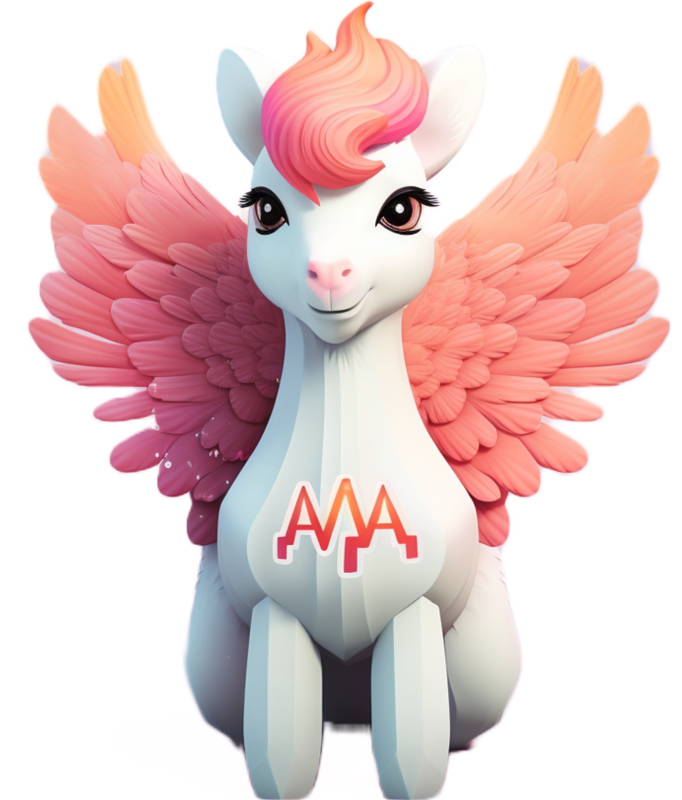

<h1 align="center">AlpaGasus: Training a Better Alpaca Model with Fewer Data</h1>
<h4 align="center"> Lichang Chen*, Shiyang Li*, Jun Yan, Hai Wang, Kalpa Gunaratna, Vikas Yadav, Zheng Tang, Vijay Srinivasan, Tianyi Zhou, Heng Huang, Hongxia Jin</h4>
<h4 align="center"> *Denotes equal contribution</h4>

## [Project page](https://lichang-chen.github.io/AlpaGasus/) | [Paper](https://arxiv.org/abs/2305.4926697)


<p align="center">
     <br>
    Our Model "AlpaGasus" is pronounced as "/ˈælpəˈɡeɪsəs/", or "/ˈælpəˈɡəsəs/", image is generated by <a href="https://www.midjourney.com/app/">Midjourney</a>
</p>

## Code Release
Our code is still under legal review. Stay tuned!

## Citation
If you find our paper useful, please consider citing:
```bibtex
@article{chen2023alpagasus,
  title={AlpaGasus: },
  author={Chen, Lichang and Shiyang, Li, and, Jun, Yan },
  journal={TBD},
  year={2023}
}
```